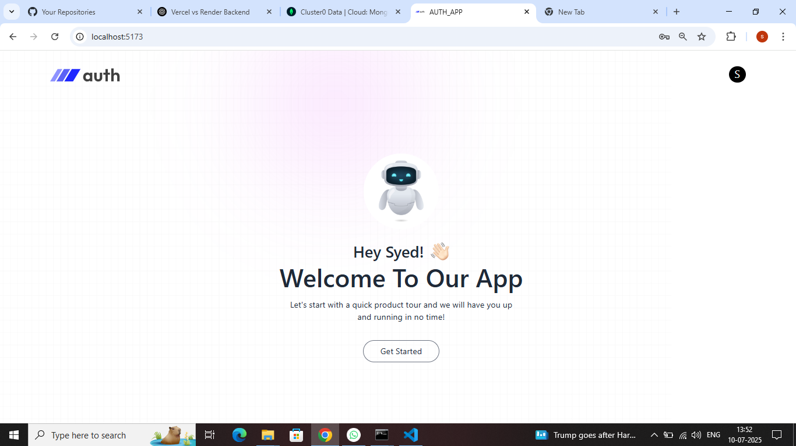
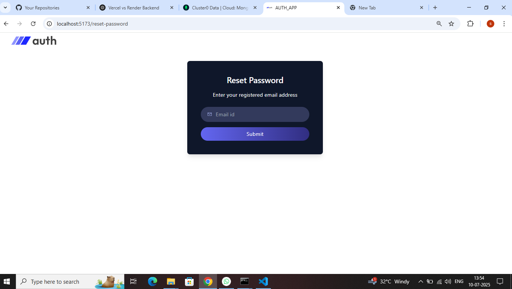
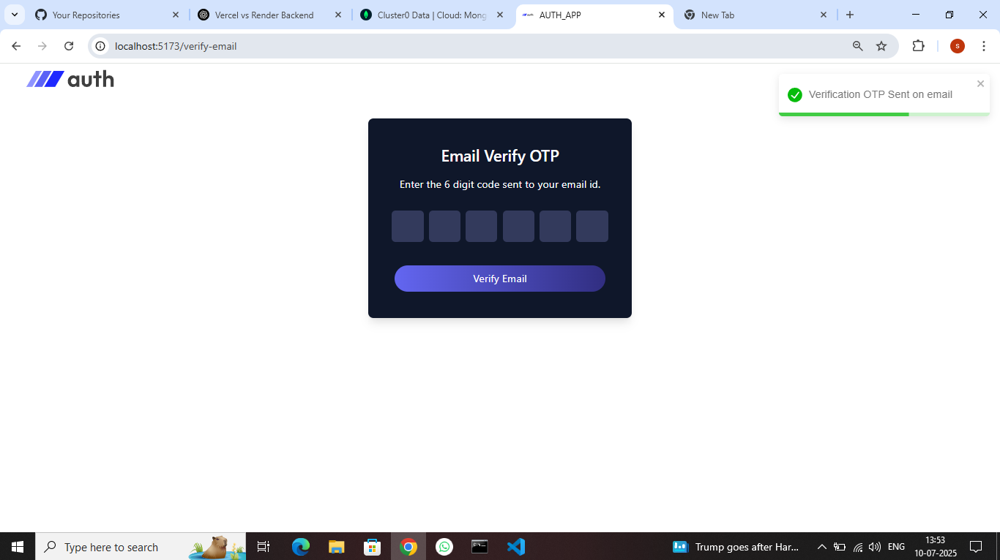

# 🔐 MERN Auth Email Verification App

A complete full-stack **authentication system** built using the **MERN stack** (MongoDB, Express, React, Node.js) with secure login, email OTP verification, and password reset flow — perfect for production-ready projects.

---

## 🚀 Features

- ✅ Secure JWT Auth (stored in HttpOnly Cookies)
- 📩 Email OTP Verification via Nodemailer
- 🔐 Password Reset with Email OTP
- 👤 User Profile with Avatar and Welcome Header
- 🌐 Fully Responsive UI (Mobile + Desktop)
- 🍪 Cookie-based Login Flow
- 📤 HTML Email Templates with Cloud Support
- 🔔 Toast Notifications with `react-toastify`

---

## 🛠️ Tech Stack

| Tech        | Description                        |
|-------------|------------------------------------|
| **Frontend**| React, Tailwind CSS, Axios, Vite   |
| **Backend** | Node.js, Express, Nodemailer       |
| **Database**| MongoDB Atlas (Mongoose)           |
| **Auth**    | JWT + HTTPOnly Cookies + OTP Email |
| **Mailer**  | Nodemailer + HTML Templates        |

---

## 📸 Screenshots

### Home Page


### Reset Password


### Login Page


### Email Verification


---


## 📦 Getting Started

### 1️⃣ Clone the Repository

```bash
# 1. Clont The Repo
git clone https://github.com/syedthedev/mern-auth-app.git
cd mern-auth-app

# 2. Backend
cd Server
npm install
node Server.js

# 3. Frontend
cd Client
npm run dev
